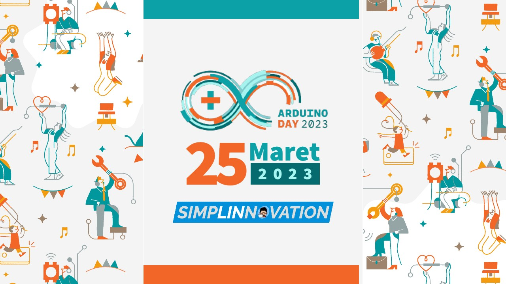
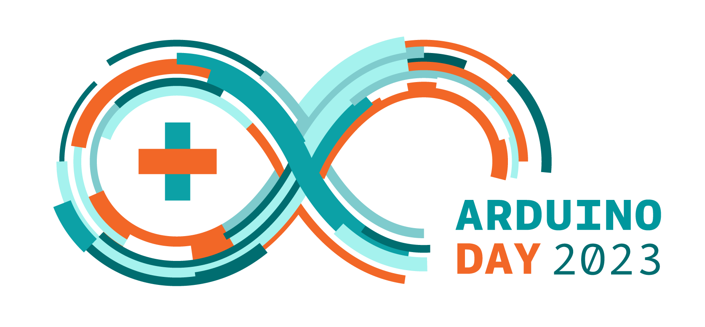

## Arduino Day 10° edition
### 🎉 Arduino Day 2023 at SimpLINnovation: Innovate to Elevate 🎉

 

__Arduino Day__ merupakan event tahunan yang digelar oleh official Arduino maupun komunitas Arduino untuk menyemarakkan hari ulang tahun Arduino. Tahun 2023 ini, Arduino Day memasuki edisi yang ke-10 dan bertepatan dengan bulan suci Ramadhan 1444 H. Selamat menunaikan ibadah puasa, semoga amal ibadah kita mendapat balasan terbaik dari Allah SWT. SimpLINnovation turut menyemarakkan Arduino Day 2023 melalui program talkshow online bertajuk __*"Innovate to Elevate"*__ di kanal YouTube [@lintangwisesa](https://youtu.be/tI4n8vbw7c0). Yuk catat tanggal, agenda dan ikuti acaranya:

    Hari, tanggal: 📅 Sabtu, 25 Maret 2023
    Jam          : ⏰ 09.00 WIB (GMT+7)
    Tempat       : 🎥 youtube.com/@lintangwisesa
    Link         : 📺 https://youtu.be/tI4n8vbw7c0 
    Narasumber   :  - Tim PKM-KI UGM peraih perak PIMNAS 2022
                    - Tim PKM-KC UB peraih emas PIMNAS 2022
                    - Taufik Jati Saputra, innovator Noisy Box
                    - Ashif Hujjatul Islami, founder KMTek

 

Di segmen pertama kami hadirkan tim PKM-KI Universitas Gadjah Mada peraih medali perak PIMNAS 2022 dengan karya berjudul "Jacket Air Cushion Restraint Safety System Berbasis Arduino". Tim ini diketuai oleh Ademas Alam Pangestu, dibimbing oleh Ir. Ma'un Budiyanto S.T., M.T. dengan beranggotakan: Genesis Junior Sumlang, Saadah Mardatillah, Wahyu Agong Nugroho Jati dan Alfian Eka Setyawan.

 

Di segmen kedua kita akan berbincang dengan tim PKM-KC Universitas Brawijaya peraih medali emas PIMNAS 2022 dengan karya berjudul "Alat Preventif Hipertensi dan Hiperkolesterolemia bagi Penderita Stroke Terintegrasi Internet of Things dengan Klasifikasi Metode Machine Learning". Tim ini diketuai oleh Muhammad Dwi Nur Afini, dibimbing oleh Ir. Nurussa'adah M.T., dengan beranggotakan: Abimanyu Awanda Ragil, Ayu Cetiya Mahayekti, I Made Ananta Wiragunawan dan Muhammad Romadhoni Prabowo.

 

Segmen selanjutnya akan diisi oleh innovator Noisy Box, alat mitigasi konflik manusia dan gajah, Taufik Jati Saputra. Noisy Box berhasil meraih Juara 1 pada WWF Panda Innovative Competition 2019 dan Juara 2 IdenTIK Kominfo  kategori Corporate Social Responsibility.

 

Di sesi terakhir kita akan berbincang dengan Ashif Hujjatul Islami, founder KMTek (Karya Merapi Teknologi). KMTek merupakan startup IoT (Internet of Things) yang fokus pada produksi development board, pelatihan dan konsultasi seputar implementasi IoT. Salah satu IoT development board karya KMTek yang sudah dipasarkan adalah Mappi32 berbasis ESP32.

Sampai jumpa di [__Arduino Day 2023 at SimpLINnovation__](https://youtu.be/tI4n8vbw7c0)!

 

